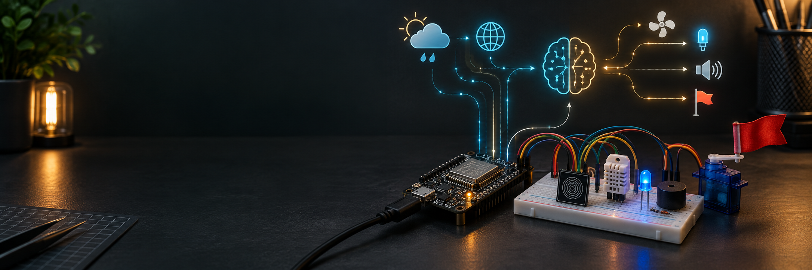

# ESP_Chitchat



An open-hardware learning and demonstration platform that makes the path from software to the physical world visible:

```text
LOGIC → GPIO → SENSOR → INTERNET → API → DECISION → PHYSICAL ACTION
```

ESP_Chitchat is designed for complete beginners, but organised so the same ideas can grow into serious ESP32/IoT projects.

## What is working now

| Capability | Status | Entry point |
|---|---|---|
| Browser Event Box | Ready | [`demo-day/web-simulator/`](demo-day/web-simulator/) |
| Touch LED Arduino sketch | Ready for board testing | [`demo-day/arduino/touch_led/`](demo-day/arduino/touch_led/) |
| Event Box Arduino sketch | Serial-event prototype | [`demo-day/arduino/event_box/`](demo-day/arduino/event_box/) |
| Scratch activity specification | Ready to build in Scratch | [`demo-day/scratch/README.md`](demo-day/scratch/README.md) |
| Demo Day presentation | 15-slide focused deck | [`esp32-open-hardware-demo-day-marp.md`](esp32-open-hardware-demo-day-marp.md) |
| Live weather API adapter | Planned | See [`docs/ARCHITECTURE.md`](docs/ARCHITECTURE.md) |
| Shared phone controller | Planned | Static simulator currently runs locally |

## Run the demo in 60 seconds

Requirements: Python 3.

```bash
python3 -m http.server 8000 --directory demo-day
```

Open <http://localhost:8000/web-simulator/> and select **Rain expected**, **Football goal**, or **Plant is dry**. The browser page is a deterministic visual simulator; it does not pretend to be a physical ESP board or a live API.

## The three demonstrations

### 1. Touch LED

```text
TTP223B touch sensor → ESP8266 → onboard LED
```

The audience describes the behaviour in plain English, converts it to logic, and changes the sketch.

### 2. Weather Event Box

```text
weather event → ESP32/ESP8266 decision → light + buzzer + servo flag
```

The current presentation uses a simulated event. Open-Meteo is the researched candidate for a later live adapter.

### 3. Football Event Box

```text
goal event → event normalisation → light + buzzer + servo flag
```

The event is intentionally simulated until a specific provider, competition, authentication method, quota, and schema are selected.

## Architecture

```text
Scratch / web input
        ↓
event vocabulary: rain | goal | plant | clear
        ↓
browser simulator or future API adapter
        ↓
ESP8266 hardware / simulated ESP32
        ↓
LED · buzzer · servo · display
```

The shared event vocabulary is the integration boundary. Simulation, APIs, and firmware can evolve independently.

## Recommended learning path

```text
Scratch → Wokwi → Arduino C/C++ → ESP8266/ESP32 → HTTP/JSON → MQTT → AI
```

Use Scratch to explain decisions, Wokwi to test circuits without hardware, Arduino IDE for the first firmware upload, and ESP-IDF/PlatformIO for the professional ESP32 path.

## Repository guide

| Document | Purpose |
|---|---|
| [`docs/RESEARCH.md`](docs/RESEARCH.md) | Hardware limits, simulator boundaries, API and teaching decisions. |
| [`docs/ARCHITECTURE.md`](docs/ARCHITECTURE.md) | Current system and future live-weather architecture. |
| [`docs/DEMO_DAY_RUNBOOK.md`](docs/DEMO_DAY_RUNBOOK.md) | Setup, timing, and failure handling for the event. |
| [`DEVICES.md`](DEVICES.md) | Exact 22-in-1 module inventory and output shopping list. |
| [`SIMULATORS.md`](SIMULATORS.md) | Scratch, Wokwi, Arduino, MicroPython, and ESP-IDF toolchain. |
| [`RESOURCES.md`](RESOURCES.md) | Official repositories, awesome lists, IDEs, and project sites. |
| [`GITHUB_SEARCH.md`](GITHUB_SEARCH.md) | How to find and evaluate ESP projects on GitHub. |
| [`PROJECTS.md`](PROJECTS.md) | Selected Wokwi, Hackaday, Arduino, and ESP32 references. |
| [`CONTRIBUTING.md`](CONTRIBUTING.md) | Coding, hardware, documentation, and pull-request expectations. |

## Development commands

```bash
make check    # whitespace and required-file checks
make serve    # local browser simulator on port 8000
make render   # regenerate Marp HTML and PDF decks
```

For hardware, open the matching `.ino` file in Arduino IDE, confirm the board and pin map, then test with the serial monitor. Do not copy pin assignments between ESP8266 and ESP32 without checking the board documentation.

## Engineering boundaries

- The 22-in-1 pack is a sensor/module kit; it does not include the full output kit.
- ESP8266 has one user ADC channel; ESP32 ADC2 has Wi-Fi interaction constraints.
- Servos, motors, relays, and pumps need appropriate power and driver circuitry.
- API keys and Wi-Fi credentials must never be committed.
- Community projects are references; official Espressif, Arduino, and Wokwi documentation takes precedence.

## Roadmap

1. Add committed Wokwi `diagram.json` projects for Touch LED and Event Box.
2. Add an Open-Meteo adapter that produces the shared event schema.
3. Add tests for event normalisation and browser controls.
4. Add optional shared phone control through a small local WebSocket service.
5. Add wiring diagrams, licensed visual assets, and real hardware photos.
